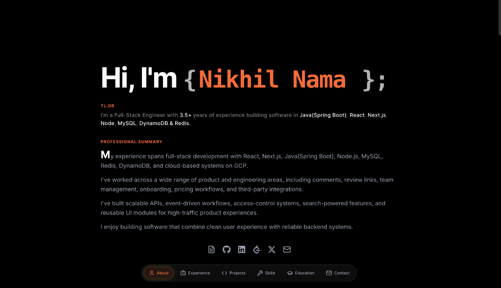
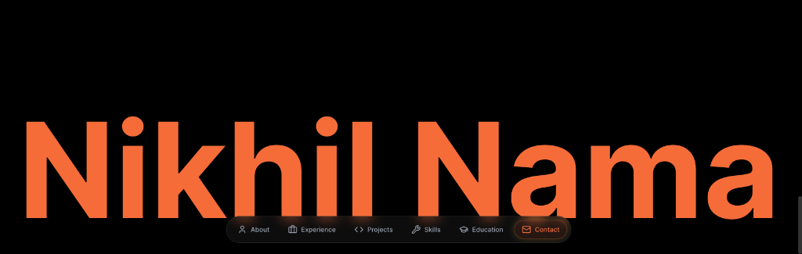

# Nikhil Nama Portfolio




A premium developer portfolio built to showcase Work, experience, skills, and contact details through a polished dark UI with vibrant orange accents and liquid-glass styling.

## Live Project

- Deployment Link: [https://nikhil-nama.vercel.app/](https://nikhil-nama.vercel.app/)

## Who Built It

Built by **Nikhil Nama**.

- X (Twitter): [https://x.com/Nick_1807](https://x.com/Nick_1807)
- LinkedIn: [https://www.linkedin.com/in/nikhilnama18/](https://www.linkedin.com/in/nikhilnama18/)

## About The Project

This repository contains a responsive personal portfolio built with Next.js, React, TypeScript, and Tailwind CSS. The experience is designed as a personal brand statement as much as a technical showcase, featuring:

- A premium dark theme with vibrant orange highlights
- Liquid-glass cards and navigation
- A spotlight mouse-tracking effect
- Animated section transitions
- An interactive experience section
- A skills layout tailored for mobile and desktop
- A contact form powered by Web3Forms
- A large signature-style footer treatment

If you were referring to this as a "game," this repo itself is currently a portfolio website codebase.


## Technologies Used

- [Next.js 16](https://nextjs.org/)
- [React 19](https://react.dev/)
- [TypeScript](https://www.typescriptlang.org/)
- [Tailwind CSS v4](https://tailwindcss.com/)
- [Framer Motion](https://www.framer.com/motion/)
- [Lucide React](https://lucide.dev/)
- [React Icons](https://react-icons.github.io/react-icons/)
- [Web3Forms](https://web3forms.com/) for contact form handling
- [Vercel](https://vercel.com/) for deployment

## Project Structure

```text
src/
├── app/
│   ├── layout.tsx
│   ├── page.tsx
│   └── globals.css
├── components/
│   ├── ContactSection.tsx
│   ├── EducationSection.tsx
│   ├── ExperienceSection.tsx
│   ├── Hero.tsx
│   ├── LiquidNav.tsx
│   ├── ProjectsSection.tsx
│   ├── SectionShell.tsx
│   ├── SignatureFooter.tsx
│   ├── SkillsSection.tsx
│   ├── SocialLinks.tsx
│   └── Spotlight.tsx
└── data/
    ├── experience.ts
    └── skills.ts
```

## Local Setup

1. Install dependencies:

```bash
npm install
```

2. Create a local environment file:

```bash
cp .env.example .env.local
```

3. Add your Web3Forms access key to `.env.local`:

```bash
NEXT_PUBLIC_WEB3FORMS_ACCESS_KEY=your_web3forms_access_key
```

4. Start the development server:

```bash
npm run dev
```

5. Open [http://localhost:3000](http://localhost:3000)

## Available Scripts

- `npm run dev` - start the development server
- `npm run build` - create a production build
- `npm run start` - run the production server
- `npm run lint` - run ESLint

## Deployment

This project is deployed on [Vercel](https://vercel.com/). To deploy your own version:

1. Push the repository to GitHub
2. Import the repo into Vercel
3. Add the required environment variable:
   `NEXT_PUBLIC_WEB3FORMS_ACCESS_KEY`
4. Deploy

## Notes

- The contact form depends on a valid Web3Forms public access key.
- The codebase is structured to be reusable as a premium portfolio template.
